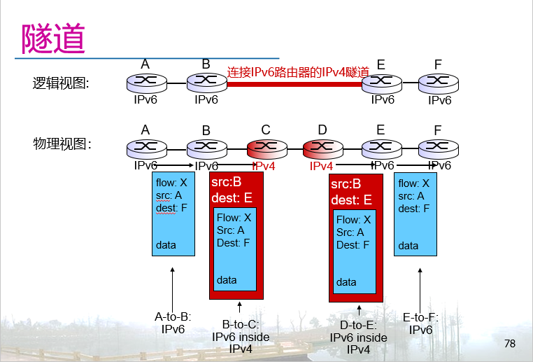

# Chapter 4

Review at Monday, December 16th, 2024

## 4.1 网络层概览

### 网络层

* 将传输层分段从源送到目的地
* 在发送端将分段封装为网络层报文
* 在接收端从报文中提取分段，交给传输层
* **所有的**主机、路由器都运行网络层
* 路由器检查所有经过的IP报文头部

### 网络层功能

* **转发**：将数据包从路由器的入端口转移到正确的出端口
* **路由**：决定数据包从源到目的地的转发路径
* **建立连接**：仅限于某些网络体系结构，连段中继在传输数据前先建立虚拟电路

> [!NOTE]  
> ### 网络层连接 vs 传输层连接
> 网络层：两台主机之间（一些情况需要岩土路由器支持）
> 传输层：两个进程之间

### 数据平面

* 每个路由器都具备的本地能力
* 决定如何将保温从入端口转发到出端口
* 转发功能

### 控制平面

* 整个网络具备的能力
* 决定报文从源到目的地的，由沿途路由器路由的，端到端路径
* 两类控制平面方案：
  * 传统的路由算法：在每个路由器上实现，每个路由器中都有单独的路由算法模块，它们相互交互，一起构成控制平面
  * 软件定义网络（SDN）：逻辑上集中实现，单独的（远程）控制器与路由器本地的控制代理（CA）交互

> [!Notice]
> 作为从发送端到接收端的逻辑信道，提供怎样的服务模型？
> 为单个报文提供服务的例子:
> * 确保送到
> * 确保限时送到
> 
> 为一个报文流（flow）提供服务的例子:
> * 顺序送达
> * 最小宽带保障
> * 保温到达时间间隔约束

## 4.2 虚电路和数据报网络

**数据报**网络提供无连接的网络服务
**虚电路**网络提供有连接的网络层服务
类似TCP/UDP，但是有连接与无连接服务不能共存，有网络核心部分（路由器）实现

### 虚电路

> 性能保障
> 网络操作的执行对象是整个路径，而非单个路由器

* 在数据传输前后建立和撤销呼叫
* 每个数据包携带虚电路标识，而非目的地主机的地址
* 每个路由器对经过的连接维护状态
* 链路和路由器资源可能被分配到虚电路上（资源独享而非共享）

### 虚电路实现

* 一条虚电路包含
  * 源到目的地的路径
  * VC编号，路径上每条链路有一个编号
  * 路径上沿途路由器转发表项
* 属于某条虚电路的数据包携带虚电路编号（而非目的地址）
* 同一条虚电路的编号在不同链路上可能不同
  * 对每个数据包，路由器将旧的虚电路编号替换为新的
  * 新的虚电路编号由转发表确定

### 虚电路生命期

* 建立虚电路：确定源到目的地路径；沿途路由器确定每条链路的虚电路编号；在转发表中添加表项
* 数据传输：数据包沿路径传输
* 撤销虚电路：更新路由器转发表

> ![!Notice]
> 因特网不采用虚电路

### 数据报网络

* 不建立网络层连接
* 路由器不保持端到端连接的状态
* 路由器依据数据包的目的地地址转发数据包

### 数据报路由

* 路由器在转发表中保持转发状态信息
* 转发表项由路由算法确定
  * 1-5分钟更新一次
  * 转发表项的内容和当前路由器中是否存在相关地址的数据包没有关系
* 从相同的源地址到目的地址的数据报可能经过不同的路径

## 4.3 路由器内部结构和功能

### 输入端口结构

接线口
* 物理层
 
链路层协议（接收端）
* 链路层

排队，查表转发
* 分布式交换：
  * 用报文头部字段，查询转发表，确定报文的输出端口。转发表存储在输入端口的内存中（匹配-转发）
  * 以线速处理数据包
  * 排队: 如果接收数据包的速率高于将数据包发送到交换背板的速率，暂存在队列中
  * 基于目的地的转发：依据报文的目的地地址确定输出端口，或者广义转发：依据任意字段内容确定输出端口
  
  
### 最长前缀匹配

当目的地址落在多个表项的范围内，使用产生最长前缀匹配的表项。

### 交换背板

* 将数据包从输入端口队列转移到输出端口队列
* 交换速率：每秒转移的数据包数量
  * 通常用端口线速的倍数标识
  * N个数据端口：理想情况，N倍线速的交换速率
* 三类交换背板：
  * 内存
  * 总线
  * 交叉结构

### 输出端口

其实是输入端口的结果反过来

* 当从背板到达的数据包速率超过端口传输速率，需要缓存数据包
* 调度策略，从队列中选取特定数据包传输

> 优先调度：传输在最高优先级队列中排队的数据包
> 轮询调度：将数据包分为多个类，对应多个队列
> 加权公平排队（WFQ）：广义的轮询，每次检查队列时，按权重比例传输队列中的数据包

## 4.4 IP协议

### IP分片和重组

最后一个分片flag设置为0，其余分片的flag设置为1
IP头部为20bytes

* 网络链路能够传输的最大帧大小被称为MTU
  * 不同的链路类型，不同的MTU
  * 以太网，1500 Bytes
* 当IP报文大小超过链路MTU，由路由器分片
  * 把一个报文分为多个报文
  * 在目的地重组
  * IP头部包含字段，携带分片重组所需信息

### IP地址

* IP地址：32bit，用于表示朱姐和路由器的网络接口
* 网络接口：连接主机/路由器和物理传输介质
  * 路由器通常有多个网络接口
  * 朱姐通常有一个或两个网络接口
* 每个网络接口都关联一个IP地址

> ![Notice]
> 网络接口之间怎么连接?
> 有线以太网接口由以太网交换机连接
> 无线WiFi接口由WiFi接入点互连

### 子网

* IP地址：
  * 子网部分：高位
  * 主机部分：低位
* 什么是子网？
  * 子网里设备接口的IP地址具有相同的子网部分（逻辑意义）
  * 子网中接口之间可以不经过路由器互通连接（物理意义）

> ![Notice]
> 判断子网的方法：
> 将网络接口从主机或者路由器上剥离,形成一个或多个网络

### IP地址：CIDR

地址的子网部分可以是任意长度
CIDR格式: a.b.c.d/x, 其中x是子网部分的比特个数

* 低位bit部分可能包含（也可能不包含）更多的子网结构
  * 200.23.16.0/23 可能包含两个更小的子网: 200.23.16.0/24 和 200.23.17.0/24. 
* 在CIDR之前，使用分类地址的方案,
  * 地址中8-、16-、和 24-bit 子网部分的网络被称为A、B、和C类网络。
* 广播地址：255.255.255.255
  * 以该地址作为目的地址，将报文送到子网中每个主机（不能越过路由器）

> 子网的网络地址：子网部分不变，主机部分全0
> 子网掩码：网络部分全1，主机部分全0
> 子网中IP地址 AND 子网掩码 = 子网的网络地址，
> 子网部分比特数被称为掩码长度
> 广播地址：网络部分不变，主机部分全1
> 最小用户地址（子网内可以分配给主机的最小地址）：网络部分不变，主机部分最小非全0
> 最大用户地址（子网内可以分配给主机的最大地址） ：网络部分不变，主机部分最大非全1

### 主机如何获得IP地址

* 由管理员硬编码到操作系统中
* DHCP（动态主机配置协议）：从服务器动态地获得地址
  * 按需使用，即插即用 
  
### DHCP

> DHCP是应用层协议，由UDP报文携带

当主机加入网络时，从网络服务器动态地获得IP地址，三种情况：

* 从网络中“租”一个地址，可以续租当前使用中的地址。
* 地址可以重用 （主机下线，地址被分配给其它新上线的主机）
* 移动用户加入网络，获得地址

> ![Notice]
> DHCP：不仅仅是分配IP地址
> 除了IP地址，DHCP可以向主机提供子网中如下信息：
> 
> * 子网第一跳路由器的地址（网关地址）
> * DNS服务器的名字和地址
> * 子网掩码 (地址中子网部分和主机部分的长度)
> 子网中没有DHCP服务器时，可使用DHCP中继代理转发相关的消息。

问：如何获得IP地址的子网部分？
> 答：机构从ISP的地址空间中分配

问：运营商如何获得地址块？
> 答：[ICANN](http://www.icann.org/): Internet Corporation for Assigned Names and Numbers
> 
> * 分配地址
> * 管理DNS
> * 分配域名、处理纷争

### 私有地址（内网地址）

* 公有地址，由ISP分配，通过因特网路由协议路由可达
* 私有地址，在机构/家庭内部网络使用
* 三块地址空间
  * 10.0.0.0/8、172.16.0.0/12、192.168.0.0/24
  * 用于在私有网络上分配IP地址
* 产生的原因
  * IPv4地址数量有限，无法为每台主机分配一个IP地址

### NAT：网络地址翻译

所有离开本地网络的报文源地址都相同；所有在本地网络上传输的报文，源地址和目的地址都在**私有地址**范围内

动机：本地网络对外只使用一个IP地址（公网）：

* 无需从运营商获得包含多个连续地址的地址段，只需要获得一个地址，本地网络上所有设备都可接入因特网
* 本地网络上改变设备的IP地址，无须对外通知
* 改换ISP时无需改变设备上的IP地址
* 本地网络内部的设备无法从外面寻址和访问(更安全)

实现: NAT路由器必须:

* 向外的报文：替换每个报文的 (源IP地址, 端口号)为(NAT路由器的IP地址, 新端口号)
  * . . . 因特网上的远程客户端/服务器以(NAT路由器的IP地址，新端口号)作为目的地回复报文
* 在(NAT翻译表)中记住每个(源IP地址, 端口号)和(NAT路由器的IP地址, 新端口号)的映射关系
* 向内的报文: 查询NAT翻译表，替换每个报文的目的地址和端口号字段的 (NAT路由器的IP地址, 新端口号)为(源IP地址, 端口号)

16-bit端口号字段: 

* 支持本地局域网一侧的超过60,000并发连接

NAT有争议:

* 路由器应该仅具备1-3层的报文处理功能
* 地址短缺应该由IPv6解决
* 破坏了传输层端到端的设定
  * 设计实现网络应用时必须考虑NAT的存在，例如，P2P应用
* 穿越NAT:如果客户端希望连接NAT背后的服务器，该怎么办？

#### NAT穿越

* 客户端希望连接地址为10.0.0.1的服务器
  * 无法使用10.0.01.作为目的IP地址发出连接请求
  * 只有NAT路由器地址138.76.29.7路由可达

* 方案1: 静态配置NAT表，将某端口的连接请求转发到某个内网服务器
  * 例如, 总是将发到(123.76.29.7, 端口 25000) 的连接请求转发给 10.0.0.1 端口 25000
* 方案2: Universal Plug and Play (UPnP) Internet Gateway Device (IGD) 协议。内网主机可以:
  * 主动获得NAT路由器的外网地址(138.76.29.7)
  * 请求NAT路由器在( 内网IP地址, 主机端口号) 和( 公网地址, 端口号)之间建立映射表项，自动实现端口映射。

### IPv6

* 初始目的：32 bit 的地址空间即将被耗尽
* 更多目的：
  * 使用更便于路由器处理转发的报文头部格式
  * 在头部添加支持服务质量差异的字段
* IPv6报文头部：
  * 固定40 bytes头部长度
  * 不允许分片

> IPv4的头部为20 bytes

#### 不同于IPv4之处

* 优先级（priority）: 数据包优先级
* 流标签（flow label）: 标识属于同一个“流”的报文下一层头部: 标识上层协议
* 校验和: 移除，以节约路由器报文处理的时间
* 选项:仍然支持，但是不属于头部，由 “下一层头部”字段指示
* ICMPv6：新版本的ICMP
  * 更多的消息类型, 例如 “数据包太大”
  * 多播的组管理功能

IPv4的报文格式：
R1HKN%IIF`P$SBL{CL.png>)

IPv6的报文格式：
MXR~7W{0PA]D0T7GUO.png>)

#### 从IPv4到IPv6过渡

无法同时升级所有路由器，怎样让IPv4和IPv6在网络中共存？

##### 隧道

把IPv6报文作为负载，由IPv4报文携带，被IPv4路由器处理转发。
[Q1S}U{NDHGKW.png>)

##### 双栈

路由器同时具备收发IPv4和IPv6报文的能力

